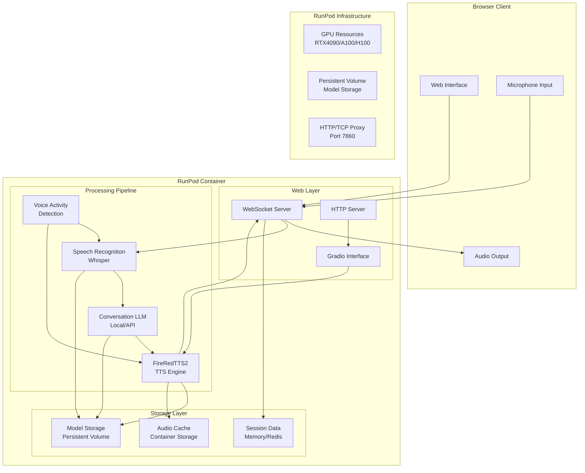

# Design Document

## Overview

This design document outlines the architecture and implementation strategy for deploying the FireRedTTS2 system on RunPod cloud platform with enhanced speech-to-speech conversation capabilities. The system will provide a comprehensive web-based interface that enables real-time audio processing, voice cloning, multi-speaker dialogue generation, and conversational AI interactions through a browser-accessible interface.

The deployment leverages RunPod's GPU infrastructure while working within platform constraints (HTTP/TCP only networking, container-based deployment) to deliver a high-performance, low-latency speech synthesis and conversation system.

## Architecture

### High-Level System Architecture



### Component Architecture

The system follows a modular, event-driven architecture with the following key components:

1. **Web Interface Layer**: Enhanced Gradio interface with custom WebSocket handlers
2. **Audio Processing Pipeline**: Real-time speech-to-speech processing chain
3. **Model Management**: Efficient loading and caching of ML models
4. **Session Management**: Conversation state and user session handling
5. **Performance Monitoring**: Real-time metrics and system health monitoring

## Components and Interfaces

### 1. Enhanced Web Interface

**Purpose**: Provide comprehensive browser-based interface for all system functionality

**Key Features**:
- Real-time audio input/output controls
- Voice cloning interface with reference audio upload
- Multi-speaker dialogue configuration
- Performance monitoring dashboard
- Conversation history and session management

**Technical Implementation**:
- Extended Gradio interface with custom JavaScript components
- WebRTC for browser microphone access
- WebSocket connections for real-time audio streaming
- Responsive design optimized for RunPod's proxy system

**Interfaces**:
```python
class WebInterface:
    def handle_audio_stream(self, websocket, audio_chunk: bytes) -> None
    def upload_reference_audio(self, audio_file: UploadedFile) -> VoiceProfile
    def start_conversation_session(self, config: ConversationConfig) -> SessionID
    def get_performance_metrics(self) -> PerformanceData
```

### 2. Speech Recognition Module (ASR)

**Purpose**: Convert incoming audio to text for conversation processing

**Implementation**: OpenAI Whisper model optimized for real-time processing

**Key Features**:
- Streaming audio processing with chunking
- Multiple language support
- Voice activity detection integration
- Optimized for low-latency inference

**Interfaces**:
```python
class SpeechRecognizer:
    def transcribe_stream(self, audio_stream: AudioStream) -> Iterator[TranscriptionResult]
    def transcribe_chunk(self, audio_chunk: AudioChunk) -> Optional[str]
    def set_language(self, language_code: str) -> None
    def get_supported_languages(self) -> List[str]
```

### 3. Conversation LLM Integration

**Purpose**: Process transcribed text and generate conversational responses

**Implementation Options**:
- Local model (Llama 2/3, Mistral) for privacy and low latency
- API integration (OpenAI, Anthropic) for advanced capabilities
- Hybrid approach with fallback mechanisms

**Key Features**:
- Context-aware conversation handling
- Personality and voice style consistency
- Multi-turn dialogue management
- Response optimization for TTS

**Interfaces**:
```python
class ConversationEngine:
    def generate_response(self, user_input: str, context: ConversationContext) -> str
    def set_personality(self, personality_config: PersonalityConfig) -> None
    def update_context(self, turn: ConversationTurn) -> None
    def get_conversation_history(self, session_id: str) -> List[ConversationTurn]
```

### 4. Enhanced FireRedTTS2 Integration

**Purpose**: Generate high-quality speech from conversation responses

**Enhancements to Existing System**:
- WebSocket streaming support for real-time output
- Dynamic voice switching for multi-speaker scenarios
- Optimized model loading and GPU memory management
- Integration with conversation context for prosody

**Key Features**:
- Maintains existing voice cloning and dialogue capabilities
- Streaming audio generation for reduced latency
- Dynamic speaker selection based on conversation context
- Quality optimization for web delivery

**Interfaces**:
```python
class EnhancedFireRedTTS2(FireRedTTS2):
    def generate_streaming(self, text: str, voice_profile: VoiceProfile) -> Iterator[AudioChunk]
    def switch_speaker(self, speaker_id: str) -> None
    def optimize_for_streaming(self, enable: bool = True) -> None
    def get_generation_metrics(self) -> GenerationMetrics
```

### 5. Voice Activity Detection (VAD)

**Purpose**: Detect speech activity for conversation flow management

**Implementation**: WebRTC VAD or custom neural VAD model

**Key Features**:
- Real-time speech/silence detection
- Conversation turn management
- Noise robustness
- Low computational overhead

**Interfaces**:
```python
class VoiceActivityDetector:
    def detect_activity(self, audio_chunk: AudioChunk) -> ActivityResult
    def set_sensitivity(self, level: float) -> None
    def get_activity_metrics(self) -> VADMetrics
```

### 6. Session and State Management

**Purpose**: Manage user sessions, conversation state, and system configuration

**Implementation**: In-memory storage with optional Redis backend for scalability

**Key Features**:
- Session persistence across WebSocket reconnections
- Conversation history management
- User preferences and voice profiles
- Performance metrics aggregation

**Interfaces**:
```python
class SessionManager:
    def create_session(self, config: SessionConfig) -> Session
    def get_session(self, session_id: str) -> Optional[Session]
    def update_session_state(self, session_id: str, state: SessionState) -> None
    def cleanup_expired_sessions(self) -> None
```

## Data Models

### Audio Data Models

```python
@dataclass
class AudioChunk:
    data: bytes
    sample_rate: int
    channels: int
    timestamp: float
    format: str  # 'wav', 'webm', 'opus'

@dataclass
class AudioStream:
    chunks: List[AudioChunk]
    total_duration: float
    is_complete: bool
    metadata: Dict[str, Any]

@dataclass
class VoiceProfile:
    profile_id: str
    reference_audio: AudioChunk
    reference_text: str
    speaker_embedding: Optional[torch.Tensor]
    language: str
    created_at: datetime
```

### Conversation Data Models

```python
@dataclass
class ConversationTurn:
    turn_id: str
    user_input: str
    system_response: str
    audio_input: Optional[AudioChunk]
    audio_output: Optional[AudioChunk]
    timestamp: datetime
    processing_time: float

@dataclass
class ConversationSession:
    session_id: str
    user_id: Optional[str]
    turns: List[ConversationTurn]
    voice_profile: Optional[VoiceProfile]
    configuration: ConversationConfig
    created_at: datetime
    last_activity: datetime

@dataclass
class ConversationConfig:
    language: str
    voice_mode: str  # 'clone', 'random', 'multi-speaker'
    response_style: str
    max_turn_length: int
    enable_interruption: bool
```

### Performance Data Models

```python
@dataclass
class LatencyMetrics:
    asr_latency: float
    llm_latency: float
    tts_latency: float
    total_latency: float
    first_packet_latency: float

@dataclass
class ResourceUsage:
    gpu_utilization: float
    gpu_memory_used: int
    gpu_memory_total: int
    cpu_utilization: float
    memory_used: int
    active_sessions: int

@dataclass
class QualityMetrics:
    audio_quality_score: float
    transcription_confidence: float
    response_relevance: float
    user_satisfaction: Optional[float]
```

## Error Handling

### Error Categories and Strategies

1. **Model Loading Errors**
   - Graceful degradation with fallback models
   - Clear error messages with recovery suggestions
   - Automatic retry with exponential backoff
   - Health check endpoints for monitoring

2. **Audio Processing Errors**
   - Format validation and conversion
   - Sample rate normalization
   - Corruption detection and handling
   - Timeout management for long operations

3. **Network and Connection Errors**
   - WebSocket reconnection with state preservation
   - Audio buffering during connection issues
   - Fallback to HTTP polling for critical operations
   - Connection quality monitoring

4. **Resource Management Errors**
   - GPU memory overflow protection
   - Process isolation for concurrent users
   - Queue management with priority handling
   - Automatic cleanup of stale resources

### Error Response Framework

```python
class ErrorHandler:
    def handle_model_error(self, error: ModelError) -> ErrorResponse
    def handle_audio_error(self, error: AudioError) -> ErrorResponse
    def handle_network_error(self, error: NetworkError) -> ErrorResponse
    def handle_resource_error(self, error: ResourceError) -> ErrorResponse
    
    def create_user_friendly_message(self, error: SystemError) -> str
    def log_error_for_monitoring(self, error: SystemError) -> None
    def trigger_recovery_action(self, error: SystemError) -> None
```

## Testing Strategy

### Testing Levels

1. **Unit Testing**
   - Individual component functionality
   - Audio processing algorithms
   - Model inference accuracy
   - Data model validation

2. **Integration Testing**
   - End-to-end pipeline testing
   - WebSocket communication
   - Model loading and caching
   - Session management

3. **Performance Testing**
   - Latency benchmarking
   - Concurrent user load testing
   - GPU memory usage optimization
   - Audio quality validation

4. **User Experience Testing**
   - Browser compatibility testing
   - Audio input/output validation
   - Interface responsiveness
   - Error handling user experience

### Test Implementation Framework

```python
class TestSuite:
    def test_audio_pipeline_latency(self) -> LatencyResults
    def test_concurrent_user_handling(self, user_count: int) -> LoadTestResults
    def test_model_accuracy(self) -> AccuracyMetrics
    def test_browser_compatibility(self) -> CompatibilityResults
    def test_error_recovery(self) -> RecoveryTestResults
```

## RunPod-Specific Optimizations

### Container Configuration

- **Base Image**: NVIDIA CUDA 11.8+ with PyTorch 2.0+
- **Container Storage**: 50GB for application and temporary files
- **Persistent Volume**: 100GB for model storage and user data
- **Memory**: 32GB+ RAM for model loading and audio processing
- **GPU**: RTX 4090 (24GB) minimum, A100 (40GB) recommended

### Network Configuration

- **Primary Port**: 7860 (Gradio default, HTTP/WebSocket)
- **Secondary Port**: 8000 (API endpoints if needed)
- **Protocol**: HTTP/TCP only (RunPod limitation)
- **WebSocket**: Upgrade from HTTP on same port
- **Proxy Compatibility**: Designed for RunPod's HTTP proxy system

### Storage Strategy

- **Model Storage**: Persistent volume mounted at `/workspace/models`
- **Cache Storage**: Container filesystem for temporary audio files
- **Session Data**: In-memory with optional Redis persistence
- **User Uploads**: Temporary storage with automatic cleanup

### Performance Optimizations

- **Model Caching**: Pre-load models on container startup
- **GPU Memory Management**: Dynamic allocation with cleanup
- **Audio Buffering**: Optimized buffer sizes for streaming
- **Connection Pooling**: Efficient WebSocket connection handling

### Monitoring and Logging

- **System Metrics**: GPU utilization, memory usage, latency
- **Application Logs**: Structured logging for debugging
- **Performance Monitoring**: Real-time dashboard for operators
- **Health Checks**: Automated system health validation

This design provides a comprehensive foundation for implementing a production-ready speech-to-speech conversation system on RunPod, addressing all requirements while optimizing for the platform's specific constraints and capabilities.