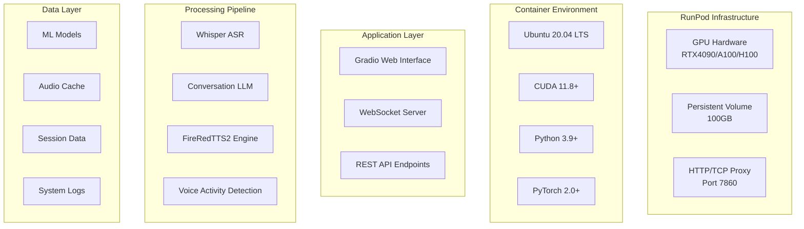

# FireRedTTS2 System Administration Guide

## Overview

This guide provides comprehensive information for system administrators managing the FireRedTTS2 deployment on RunPod. It covers monitoring, maintenance, optimization, security, and operational procedures.

## System Architecture Overview

### Component Stack



### Key System Components

1. **Web Interface**: Gradio-based frontend with custom WebSocket handlers
2. **Audio Processing Pipeline**: Real-time speech-to-speech processing
3. **Model Management**: ML model loading, caching, and optimization
4. **Session Management**: User session and conversation state handling
5. **Monitoring System**: Performance metrics and health monitoring
6. **Security Layer**: Input validation, rate limiting, and access control

## Installation and Initial Setup

### Prerequisites Verification

```bash
# System requirements check
./scripts/check_requirements.sh

# Expected output:
# ✓ GPU: RTX 4090 (24GB VRAM)
# ✓ RAM: 32GB available
# ✓ Storage: 150GB available
# ✓ CUDA: 11.8 installed
# ✓ Python: 3.9+ available
```

### Initial Deployment

1. **Container Setup**
   ```bash
   # Clone repository
   git clone https://github.com/your-repo/fireredtts2-runpod.git
   cd fireredtts2-runpod
   
   # Install dependencies
   pip install -r requirements.txt
   
   # Download models
   python scripts/download_models.py --all
   ```

2. **Configuration**
   ```bash
   # Copy and customize configuration
   cp configs/runpod_config.json config.json
   
   # Edit configuration for your environment
   nano config.json
   ```

3. **Service Initialization**
   ```bash
   # Initialize system services
   ./scripts/init_services.sh
   
   # Start application
   ./container_startup.sh
   ```

### Configuration Management

#### Main Configuration File (config.json)

```json
{
  "system": {
    "gpu_device": "cuda:0",
    "max_concurrent_users": 4,
    "model_cache_size": 8,
    "enable_monitoring": true,
    "log_level": "INFO"
  },
  "models": {
    "whisper_model": "base",
    "tts_model_path": "/workspace/models/fireredtts2",
    "llm_model": "local",
    "model_precision": "fp16"
  },
  "audio": {
    "sample_rate": 22050,
    "channels": 1,
    "format": "wav",
    "buffer_size": 1024
  },
  "network": {
    "host": "0.0.0.0",
    "port": 7860,
    "websocket_enabled": true,
    "cors_enabled": true
  },
  "security": {
    "rate_limiting": true,
    "max_requests_per_minute": 60,
    "max_upload_size_mb": 50,
    "input_validation": true
  },
  "performance": {
    "enable_caching": true,
    "preload_models": true,
    "optimize_for_latency": true,
    "gpu_memory_fraction": 0.9
  }
}
```

#### Environment Variables

```bash
# GPU Configuration
export CUDA_VISIBLE_DEVICES=0
export PYTORCH_CUDA_ALLOC_CONF=max_split_size_mb:512

# Application Settings
export GRADIO_SERVER_NAME=0.0.0.0
export GRADIO_SERVER_PORT=7860
export LOG_LEVEL=INFO

# Model Paths
export MODEL_CACHE_DIR=/workspace/models
export AUDIO_CACHE_DIR=/tmp/audio_cache

# Performance Tuning
export OMP_NUM_THREADS=4
export TOKENIZERS_PARALLELISM=false
```

## System Monitoring

### Real-Time Monitoring Dashboard

Access the monitoring dashboard at: `https://your-pod-url.proxy.runpod.net/monitor`

#### Key Metrics to Monitor

1. **System Resources**
   - GPU utilization and memory usage
   - CPU usage and system memory
   - Disk I/O and storage usage
   - Network bandwidth and latency

2. **Application Performance**
   - Request processing times
   - Queue lengths and wait times
   - Error rates and success rates
   - Active user sessions

3. **Model Performance**
   - Model loading times
   - Inference latencies
   - Cache hit rates
   - Memory allocation patterns

### Monitoring Scripts

#### System Health Check

```bash
#!/bin/bash
# /workspace/scripts/health_check.sh

echo "=== FireRedTTS2 Health Check ==="
echo "Timestamp: $(date)"

# Check GPU status
echo "GPU Status:"
nvidia-smi --query-gpu=name,memory.used,memory.total,utilization.gpu,temperature.gpu --format=csv,noheader

# Check system resources
echo -e "\nSystem Resources:"
echo "CPU Usage: $(top -bn1 | grep "Cpu(s)" | awk '{print $2}' | cut -d'%' -f1)%"
echo "Memory Usage: $(free | grep Mem | awk '{printf("%.1f%%", $3/$2 * 100.0)}')"
echo "Disk Usage: $(df -h /workspace | awk 'NR==2{print $5}')"

# Check application status
echo -e "\nApplication Status:"
if pgrep -f "enhanced_gradio_demo.py" > /dev/null; then
    echo "✓ Main application running"
else
    echo "✗ Main application not running"
fi

# Check API endpoints
echo -e "\nAPI Health:"
if curl -s -f http://localhost:7860/api/health > /dev/null; then
    echo "✓ API endpoints responding"
else
    echo "✗ API endpoints not responding"
fi

# Check model status
echo -e "\nModel Status:"
python3 -c "
try:
    from enhanced_fireredtts2 import EnhancedFireRedTTS2
    tts = EnhancedFireRedTTS2()
    print('✓ TTS model loaded')
except Exception as e:
    print(f'✗ TTS model error: {e}')
"

# Check recent errors
echo -e "\nRecent Errors:"
if [ -f "/workspace/logs/error.log" ]; then
    tail -n 5 /workspace/logs/error.log
else
    echo "No error log found"
fi
```

#### Performance Monitoring

```python
#!/usr/bin/env python3
# /workspace/scripts/performance_monitor.py

import time
import json
import psutil
import GPUtil
from datetime import datetime
import requests

class PerformanceMonitor:
    def __init__(self):
        self.metrics_history = []
        self.alert_thresholds = {
            'gpu_memory': 90,  # %
            'gpu_utilization': 95,  # %
            'cpu_usage': 80,  # %
            'memory_usage': 85,  # %
            'disk_usage': 90,  # %
            'response_time': 5000  # ms
        }
    
    def collect_metrics(self):
        """Collect system and application metrics"""
        try:
            # GPU metrics
            gpus = GPUtil.getGPUs()
            gpu_metrics = {
                'utilization': gpus[0].load * 100 if gpus else 0,
                'memory_used': gpus[0].memoryUsed if gpus else 0,
                'memory_total': gpus[0].memoryTotal if gpus else 0,
                'memory_percent': (gpus[0].memoryUsed / gpus[0].memoryTotal * 100) if gpus else 0,
                'temperature': gpus[0].temperature if gpus else 0
            }
            
            # System metrics
            system_metrics = {
                'cpu_percent': psutil.cpu_percent(interval=1),
                'memory_percent': psutil.virtual_memory().percent,
                'disk_percent': psutil.disk_usage('/workspace').percent,
                'network_io': psutil.net_io_counters()._asdict()
            }
            
            # Application metrics
            app_metrics = self.get_application_metrics()
            
            metrics = {
                'timestamp': datetime.now().isoformat(),
                'gpu': gpu_metrics,
                'system': system_metrics,
                'application': app_metrics
            }
            
            self.metrics_history.append(metrics)
            self.check_alerts(metrics)
            
            return metrics
            
        except Exception as e:
            print(f"Error collecting metrics: {e}")
            return None
    
    def get_application_metrics(self):
        """Get application-specific metrics"""
        try:
            response = requests.get('http://localhost:7860/api/metrics', timeout=5)
            if response.status_code == 200:
                return response.json()
        except:
            pass
        
        return {
            'active_sessions': 0,
            'queue_length': 0,
            'average_response_time': 0,
            'error_rate': 0
        }
    
    def check_alerts(self, metrics):
        """Check for alert conditions"""
        alerts = []
        
        # GPU alerts
        if metrics['gpu']['memory_percent'] > self.alert_thresholds['gpu_memory']:
            alerts.append(f"High GPU memory usage: {metrics['gpu']['memory_percent']:.1f}%")
        
        if metrics['gpu']['utilization'] > self.alert_thresholds['gpu_utilization']:
            alerts.append(f"High GPU utilization: {metrics['gpu']['utilization']:.1f}%")
        
        # System alerts
        if metrics['system']['cpu_percent'] > self.alert_thresholds['cpu_usage']:
            alerts.append(f"High CPU usage: {metrics['system']['cpu_percent']:.1f}%")
        
        if metrics['system']['memory_percent'] > self.alert_thresholds['memory_usage']:
            alerts.append(f"High memory usage: {metrics['system']['memory_percent']:.1f}%")
        
        if metrics['system']['disk_percent'] > self.alert_thresholds['disk_usage']:
            alerts.append(f"High disk usage: {metrics['system']['disk_percent']:.1f}%")
        
        # Application alerts
        if metrics['application']['average_response_time'] > self.alert_thresholds['response_time']:
            alerts.append(f"High response time: {metrics['application']['average_response_time']}ms")
        
        if alerts:
            self.send_alerts(alerts)
    
    def send_alerts(self, alerts):
        """Send alerts to administrators"""
        timestamp = datetime.now().strftime('%Y-%m-%d %H:%M:%S')
        alert_message = f"[{timestamp}] ALERTS:\n" + "\n".join(f"- {alert}" for alert in alerts)
        
        # Log alerts
        with open('/workspace/logs/alerts.log', 'a') as f:
            f.write(alert_message + "\n")
        
        print(alert_message)
    
    def run_continuous_monitoring(self, interval=60):
        """Run continuous monitoring"""
        print("Starting performance monitoring...")
        while True:
            metrics = self.collect_metrics()
            if metrics:
                print(f"[{metrics['timestamp']}] Monitoring cycle completed")
            time.sleep(interval)

if __name__ == "__main__":
    monitor = PerformanceMonitor()
    monitor.run_continuous_monitoring()
```

### Log Management

#### Log Configuration

```json
{
  "logging": {
    "version": 1,
    "disable_existing_loggers": false,
    "formatters": {
      "standard": {
        "format": "%(asctime)s [%(levelname)s] %(name)s: %(message)s"
      },
      "detailed": {
        "format": "%(asctime)s [%(levelname)s] %(name)s:%(lineno)d: %(message)s"
      }
    },
    "handlers": {
      "console": {
        "level": "INFO",
        "class": "logging.StreamHandler",
        "formatter": "standard"
      },
      "file": {
        "level": "DEBUG",
        "class": "logging.handlers.RotatingFileHandler",
        "filename": "/workspace/logs/application.log",
        "maxBytes": 10485760,
        "backupCount": 5,
        "formatter": "detailed"
      },
      "error_file": {
        "level": "ERROR",
        "class": "logging.handlers.RotatingFileHandler",
        "filename": "/workspace/logs/error.log",
        "maxBytes": 10485760,
        "backupCount": 5,
        "formatter": "detailed"
      }
    },
    "loggers": {
      "fireredtts2": {
        "level": "DEBUG",
        "handlers": ["console", "file", "error_file"],
        "propagate": false
      }
    }
  }
}
```

#### Log Analysis Scripts

```bash
#!/bin/bash
# /workspace/scripts/analyze_logs.sh

echo "=== Log Analysis Report ==="
echo "Generated: $(date)"
echo

# Error summary
echo "=== Error Summary (Last 24 hours) ==="
find /workspace/logs -name "*.log" -mtime -1 -exec grep -h "ERROR" {} \; | sort | uniq -c | sort -nr

# Performance metrics
echo -e "\n=== Performance Metrics ==="
grep "response_time" /workspace/logs/application.log | tail -100 | awk '{sum+=$NF; count++} END {print "Average response time:", sum/count "ms"}'

# User activity
echo -e "\n=== User Activity ==="
grep "new_session" /workspace/logs/application.log | wc -l | xargs echo "New sessions today:"
grep "voice_clone" /workspace/logs/application.log | wc -l | xargs echo "Voice cloning requests:"
grep "conversation" /workspace/logs/application.log | wc -l | xargs echo "Conversation sessions:"

# System warnings
echo -e "\n=== System Warnings ==="
grep -i "warning\|warn" /workspace/logs/*.log | tail -10
```

## Maintenance Procedures

### Regular Maintenance Tasks

#### Daily Tasks

```bash
#!/bin/bash
# /workspace/scripts/daily_maintenance.sh

echo "Starting daily maintenance..."

# 1. Health check
./scripts/health_check.sh

# 2. Log rotation
find /workspace/logs -name "*.log" -size +100M -exec gzip {} \;

# 3. Clear temporary files
find /tmp -name "audio_*" -mtime +1 -delete
find /workspace/cache -name "*.tmp" -mtime +1 -delete

# 4. GPU memory cleanup
python3 -c "import torch; torch.cuda.empty_cache()"

# 5. Update system metrics
python3 scripts/collect_metrics.py --daily

echo "Daily maintenance completed"
```

#### Weekly Tasks

```bash
#!/bin/bash
# /workspace/scripts/weekly_maintenance.sh

echo "Starting weekly maintenance..."

# 1. Model cache optimization
python3 scripts/optimize_model_cache.py

# 2. Database cleanup (if using persistent storage)
python3 scripts/cleanup_old_sessions.py --days 7

# 3. Performance analysis
python3 scripts/performance_analysis.py --week

# 4. Security audit
python3 scripts/security_audit.py

# 5. Backup critical data
./scripts/backup_data.sh

echo "Weekly maintenance completed"
```

#### Monthly Tasks

```bash
#!/bin/bash
# /workspace/scripts/monthly_maintenance.sh

echo "Starting monthly maintenance..."

# 1. Full system backup
./scripts/full_backup.sh

# 2. Model updates check
python3 scripts/check_model_updates.py

# 3. Performance optimization
python3 scripts/optimize_performance.py

# 4. Security updates
apt update && apt upgrade -y

# 5. Generate monthly report
python3 scripts/generate_monthly_report.py

echo "Monthly maintenance completed"
```

### Backup and Recovery

#### Backup Strategy

1. **Model Backups**
   ```bash
   # Backup ML models
   rsync -av /workspace/models/ /workspace/backups/models/$(date +%Y%m%d)/
   
   # Compress old backups
   find /workspace/backups/models -type d -mtime +30 -exec tar -czf {}.tar.gz {} \; -exec rm -rf {} \;
   ```

2. **Configuration Backups**
   ```bash
   # Backup configuration files
   cp config.json /workspace/backups/config/config_$(date +%Y%m%d).json
   cp -r /workspace/configs/ /workspace/backups/configs_$(date +%Y%m%d)/
   ```

3. **Data Backups**
   ```bash
   # Backup user data and sessions
   python3 scripts/backup_user_data.py --output /workspace/backups/data/
   ```

#### Recovery Procedures

1. **Model Recovery**
   ```bash
   # Restore models from backup
   rsync -av /workspace/backups/models/latest/ /workspace/models/
   
   # Verify model integrity
   python3 scripts/verify_models.py
   ```

2. **Configuration Recovery**
   ```bash
   # Restore configuration
   cp /workspace/backups/config/config_latest.json config.json
   
   # Restart services
   ./scripts/restart_services.sh
   ```

3. **Complete System Recovery**
   ```bash
   # Stop all services
   ./scripts/stop_services.sh
   
   # Restore from full backup
   ./scripts/restore_full_backup.sh /workspace/backups/full/latest/
   
   # Restart system
   ./container_startup.sh
   ```

## Performance Optimization

### GPU Optimization

#### Memory Management

```python
# /workspace/scripts/gpu_optimization.py

import torch
import gc

class GPUOptimizer:
    def __init__(self):
        self.device = torch.device('cuda' if torch.cuda.is_available() else 'cpu')
    
    def optimize_memory(self):
        """Optimize GPU memory usage"""
        # Clear cache
        torch.cuda.empty_cache()
        
        # Force garbage collection
        gc.collect()
        
        # Set memory fraction
        torch.cuda.set_per_process_memory_fraction(0.9)
        
        # Enable memory mapping
        torch.backends.cudnn.benchmark = True
    
    def monitor_memory(self):
        """Monitor GPU memory usage"""
        if torch.cuda.is_available():
            allocated = torch.cuda.memory_allocated() / 1024**3
            cached = torch.cuda.memory_reserved() / 1024**3
            total = torch.cuda.get_device_properties(0).total_memory / 1024**3
            
            print(f"GPU Memory - Allocated: {allocated:.2f}GB, Cached: {cached:.2f}GB, Total: {total:.2f}GB")
            
            return {
                'allocated_gb': allocated,
                'cached_gb': cached,
                'total_gb': total,
                'utilization_percent': (allocated / total) * 100
            }
    
    def optimize_models(self):
        """Optimize model loading and inference"""
        # Enable mixed precision
        torch.backends.cudnn.allow_tf32 = True
        torch.backends.cuda.matmul.allow_tf32 = True
        
        # Optimize for inference
        torch.jit.set_fusion_strategy([('STATIC', 2), ('DYNAMIC', 2)])
```

#### Model Optimization

```json
{
  "model_optimization": {
    "enable_quantization": true,
    "quantization_bits": 8,
    "enable_pruning": false,
    "enable_distillation": false,
    "batch_size_optimization": true,
    "dynamic_batching": true,
    "model_parallelism": false,
    "gradient_checkpointing": true
  }
}
```

### Application Performance

#### Caching Strategy

```python
# /workspace/scripts/cache_manager.py

import redis
import pickle
import hashlib
from typing import Any, Optional

class CacheManager:
    def __init__(self, redis_url: str = "redis://localhost:6379"):
        self.redis_client = redis.from_url(redis_url) if redis_url else None
        self.memory_cache = {}
        self.max_memory_cache_size = 1000
    
    def get(self, key: str) -> Optional[Any]:
        """Get item from cache"""
        # Try Redis first
        if self.redis_client:
            try:
                data = self.redis_client.get(key)
                if data:
                    return pickle.loads(data)
            except:
                pass
        
        # Fallback to memory cache
        return self.memory_cache.get(key)
    
    def set(self, key: str, value: Any, ttl: int = 3600):
        """Set item in cache"""
        # Store in Redis
        if self.redis_client:
            try:
                self.redis_client.setex(key, ttl, pickle.dumps(value))
            except:
                pass
        
        # Store in memory cache
        if len(self.memory_cache) >= self.max_memory_cache_size:
            # Remove oldest item
            oldest_key = next(iter(self.memory_cache))
            del self.memory_cache[oldest_key]
        
        self.memory_cache[key] = value
    
    def generate_key(self, *args) -> str:
        """Generate cache key from arguments"""
        key_string = "|".join(str(arg) for arg in args)
        return hashlib.md5(key_string.encode()).hexdigest()
```

#### Connection Pooling

```python
# /workspace/scripts/connection_pool.py

import asyncio
import websockets
from typing import Set, Dict
import json

class WebSocketPool:
    def __init__(self, max_connections: int = 100):
        self.max_connections = max_connections
        self.active_connections: Set[websockets.WebSocketServerProtocol] = set()
        self.connection_metadata: Dict[websockets.WebSocketServerProtocol, dict] = {}
    
    async def add_connection(self, websocket: websockets.WebSocketServerProtocol, metadata: dict = None):
        """Add new WebSocket connection"""
        if len(self.active_connections) >= self.max_connections:
            await websocket.close(code=1013, reason="Server overloaded")
            return False
        
        self.active_connections.add(websocket)
        self.connection_metadata[websocket] = metadata or {}
        return True
    
    async def remove_connection(self, websocket: websockets.WebSocketServerProtocol):
        """Remove WebSocket connection"""
        self.active_connections.discard(websocket)
        self.connection_metadata.pop(websocket, None)
    
    async def broadcast(self, message: dict):
        """Broadcast message to all connections"""
        if not self.active_connections:
            return
        
        message_str = json.dumps(message)
        disconnected = set()
        
        for websocket in self.active_connections:
            try:
                await websocket.send(message_str)
            except websockets.exceptions.ConnectionClosed:
                disconnected.add(websocket)
        
        # Clean up disconnected connections
        for websocket in disconnected:
            await self.remove_connection(websocket)
    
    def get_connection_count(self) -> int:
        """Get current connection count"""
        return len(self.active_connections)
```

## Security Management

### Security Configuration

#### Input Validation

```python
# /workspace/security/input_validator.py

import re
import magic
from typing import Union, List
import bleach

class InputValidator:
    def __init__(self):
        self.allowed_audio_formats = ['audio/wav', 'audio/mpeg', 'audio/flac', 'audio/webm']
        self.max_text_length = 5000
        self.max_file_size = 50 * 1024 * 1024  # 50MB
    
    def validate_text_input(self, text: str) -> tuple[bool, str]:
        """Validate text input"""
        if not isinstance(text, str):
            return False, "Input must be a string"
        
        if len(text) > self.max_text_length:
            return False, f"Text too long (max {self.max_text_length} characters)"
        
        # Remove potentially dangerous content
        cleaned_text = bleach.clean(text, tags=[], strip=True)
        
        # Check for suspicious patterns
        suspicious_patterns = [
            r'<script.*?>.*?</script>',
            r'javascript:',
            r'data:text/html',
            r'vbscript:',
        ]
        
        for pattern in suspicious_patterns:
            if re.search(pattern, text, re.IGNORECASE):
                return False, "Potentially malicious content detected"
        
        return True, cleaned_text
    
    def validate_audio_file(self, file_data: bytes, filename: str) -> tuple[bool, str]:
        """Validate audio file upload"""
        if len(file_data) > self.max_file_size:
            return False, f"File too large (max {self.max_file_size // 1024 // 1024}MB)"
        
        # Check file type
        mime_type = magic.from_buffer(file_data, mime=True)
        if mime_type not in self.allowed_audio_formats:
            return False, f"Unsupported file format: {mime_type}"
        
        # Check filename
        if not re.match(r'^[a-zA-Z0-9._-]+$', filename):
            return False, "Invalid filename characters"
        
        return True, "Valid audio file"
```

#### Rate Limiting

```python
# /workspace/security/rate_limiter.py

import time
from collections import defaultdict, deque
from typing import Dict, Tuple

class RateLimiter:
    def __init__(self):
        self.requests: Dict[str, deque] = defaultdict(deque)
        self.limits = {
            'api': (60, 60),  # 60 requests per 60 seconds
            'upload': (10, 300),  # 10 uploads per 5 minutes
            'generation': (30, 60),  # 30 generations per minute
        }
    
    def is_allowed(self, client_id: str, endpoint_type: str) -> Tuple[bool, int]:
        """Check if request is allowed"""
        if endpoint_type not in self.limits:
            return True, 0
        
        max_requests, window_seconds = self.limits[endpoint_type]
        current_time = time.time()
        
        # Clean old requests
        client_requests = self.requests[f"{client_id}:{endpoint_type}"]
        while client_requests and client_requests[0] < current_time - window_seconds:
            client_requests.popleft()
        
        # Check limit
        if len(client_requests) >= max_requests:
            # Calculate reset time
            reset_time = int(client_requests[0] + window_seconds - current_time)
            return False, reset_time
        
        # Add current request
        client_requests.append(current_time)
        return True, 0
```

### Access Control

#### Authentication System

```python
# /workspace/security/auth_manager.py

import jwt
import hashlib
import secrets
from datetime import datetime, timedelta
from typing import Optional, Dict

class AuthManager:
    def __init__(self, secret_key: str):
        self.secret_key = secret_key
        self.active_sessions: Dict[str, dict] = {}
    
    def generate_api_key(self, user_id: str) -> str:
        """Generate API key for user"""
        payload = {
            'user_id': user_id,
            'created_at': datetime.utcnow().isoformat(),
            'key_id': secrets.token_hex(16)
        }
        
        api_key = jwt.encode(payload, self.secret_key, algorithm='HS256')
        return api_key
    
    def validate_api_key(self, api_key: str) -> Optional[dict]:
        """Validate API key"""
        try:
            payload = jwt.decode(api_key, self.secret_key, algorithms=['HS256'])
            return payload
        except jwt.InvalidTokenError:
            return None
    
    def create_session(self, user_id: str) -> str:
        """Create user session"""
        session_id = secrets.token_urlsafe(32)
        self.active_sessions[session_id] = {
            'user_id': user_id,
            'created_at': datetime.utcnow(),
            'last_activity': datetime.utcnow()
        }
        return session_id
    
    def validate_session(self, session_id: str) -> bool:
        """Validate user session"""
        if session_id not in self.active_sessions:
            return False
        
        session = self.active_sessions[session_id]
        
        # Check session timeout (24 hours)
        if datetime.utcnow() - session['last_activity'] > timedelta(hours=24):
            del self.active_sessions[session_id]
            return False
        
        # Update last activity
        session['last_activity'] = datetime.utcnow()
        return True
```

### Security Monitoring

```python
# /workspace/security/security_monitor.py

import logging
from collections import defaultdict
import time
from typing import Dict, List

class SecurityMonitor:
    def __init__(self):
        self.failed_attempts: Dict[str, List[float]] = defaultdict(list)
        self.blocked_ips: Dict[str, float] = {}
        self.max_failed_attempts = 5
        self.block_duration = 3600  # 1 hour
        
        # Setup security logger
        self.logger = logging.getLogger('security')
        handler = logging.FileHandler('/workspace/logs/security.log')
        formatter = logging.Formatter('%(asctime)s [%(levelname)s] %(message)s')
        handler.setFormatter(formatter)
        self.logger.addHandler(handler)
        self.logger.setLevel(logging.INFO)
    
    def record_failed_attempt(self, client_ip: str, attempt_type: str):
        """Record failed authentication/access attempt"""
        current_time = time.time()
        
        # Clean old attempts (last hour)
        self.failed_attempts[client_ip] = [
            t for t in self.failed_attempts[client_ip] 
            if current_time - t < 3600
        ]
        
        # Add current attempt
        self.failed_attempts[client_ip].append(current_time)
        
        # Log the attempt
        self.logger.warning(f"Failed {attempt_type} attempt from {client_ip}")
        
        # Check if should block
        if len(self.failed_attempts[client_ip]) >= self.max_failed_attempts:
            self.block_ip(client_ip)
    
    def block_ip(self, client_ip: str):
        """Block IP address"""
        self.blocked_ips[client_ip] = time.time() + self.block_duration
        self.logger.error(f"Blocked IP {client_ip} for {self.block_duration} seconds")
    
    def is_blocked(self, client_ip: str) -> bool:
        """Check if IP is blocked"""
        if client_ip in self.blocked_ips:
            if time.time() < self.blocked_ips[client_ip]:
                return True
            else:
                # Unblock expired IPs
                del self.blocked_ips[client_ip]
        return False
    
    def log_security_event(self, event_type: str, details: dict):
        """Log security event"""
        self.logger.info(f"Security event: {event_type} - {details}")
```

## Troubleshooting and Support

### Automated Diagnostics

```python
# /workspace/scripts/auto_diagnostics.py

import subprocess
import json
import requests
from datetime import datetime

class AutoDiagnostics:
    def __init__(self):
        self.checks = [
            self.check_gpu_status,
            self.check_disk_space,
            self.check_memory_usage,
            self.check_network_connectivity,
            self.check_application_status,
            self.check_model_status,
            self.check_api_endpoints
        ]
    
    def run_all_checks(self) -> dict:
        """Run all diagnostic checks"""
        results = {
            'timestamp': datetime.now().isoformat(),
            'checks': {}
        }
        
        for check in self.checks:
            try:
                check_name = check.__name__
                results['checks'][check_name] = check()
            except Exception as e:
                results['checks'][check_name] = {
                    'status': 'error',
                    'message': str(e)
                }
        
        return results
    
    def check_gpu_status(self) -> dict:
        """Check GPU status and availability"""
        try:
            result = subprocess.run(['nvidia-smi', '--query-gpu=name,memory.used,memory.total,utilization.gpu', '--format=csv,noheader,nounits'], 
                                  capture_output=True, text=True)
            if result.returncode == 0:
                gpu_info = result.stdout.strip().split(', ')
                return {
                    'status': 'ok',
                    'gpu_name': gpu_info[0],
                    'memory_used': int(gpu_info[1]),
                    'memory_total': int(gpu_info[2]),
                    'utilization': int(gpu_info[3])
                }
            else:
                return {'status': 'error', 'message': 'nvidia-smi failed'}
        except Exception as e:
            return {'status': 'error', 'message': str(e)}
    
    def check_application_status(self) -> dict:
        """Check if main application is running"""
        try:
            result = subprocess.run(['pgrep', '-f', 'enhanced_gradio_demo.py'], 
                                  capture_output=True, text=True)
            if result.returncode == 0:
                return {'status': 'ok', 'message': 'Application running'}
            else:
                return {'status': 'error', 'message': 'Application not running'}
        except Exception as e:
            return {'status': 'error', 'message': str(e)}
    
    def check_api_endpoints(self) -> dict:
        """Check API endpoint availability"""
        endpoints = [
            'http://localhost:7860/api/health',
            'http://localhost:7860/api/tts',
            'http://localhost:7860/api/clone'
        ]
        
        results = {}
        for endpoint in endpoints:
            try:
                response = requests.get(endpoint, timeout=5)
                results[endpoint] = {
                    'status': 'ok' if response.status_code == 200 else 'error',
                    'status_code': response.status_code
                }
            except Exception as e:
                results[endpoint] = {'status': 'error', 'message': str(e)}
        
        return results
```

### Support Tools

#### Log Collector

```bash
#!/bin/bash
# /workspace/scripts/collect_support_info.sh

SUPPORT_DIR="/workspace/support_$(date +%Y%m%d_%H%M%S)"
mkdir -p "$SUPPORT_DIR"

echo "Collecting support information..."

# System information
echo "=== System Information ===" > "$SUPPORT_DIR/system_info.txt"
uname -a >> "$SUPPORT_DIR/system_info.txt"
lsb_release -a >> "$SUPPORT_DIR/system_info.txt" 2>/dev/null
nvidia-smi >> "$SUPPORT_DIR/system_info.txt"

# Configuration files
cp config.json "$SUPPORT_DIR/"
cp -r /workspace/configs "$SUPPORT_DIR/" 2>/dev/null

# Logs
mkdir -p "$SUPPORT_DIR/logs"
cp /workspace/logs/*.log "$SUPPORT_DIR/logs/" 2>/dev/null

# Process information
ps aux > "$SUPPORT_DIR/processes.txt"
netstat -tulpn > "$SUPPORT_DIR/network.txt"

# Disk usage
df -h > "$SUPPORT_DIR/disk_usage.txt"
du -sh /workspace/* > "$SUPPORT_DIR/directory_sizes.txt"

# Run diagnostics
python3 /workspace/scripts/auto_diagnostics.py > "$SUPPORT_DIR/diagnostics.json"

# Create archive
tar -czf "${SUPPORT_DIR}.tar.gz" "$SUPPORT_DIR"
rm -rf "$SUPPORT_DIR"

echo "Support information collected: ${SUPPORT_DIR}.tar.gz"
```

## Scaling and Load Management

### Horizontal Scaling

For high-traffic deployments, consider these scaling strategies:

1. **Load Balancer Configuration**
   ```nginx
   upstream fireredtts_backend {
       server pod1.runpod.net:7860;
       server pod2.runpod.net:7860;
       server pod3.runpod.net:7860;
   }
   
   server {
       listen 80;
       location / {
           proxy_pass http://fireredtts_backend;
           proxy_set_header Host $host;
           proxy_set_header X-Real-IP $remote_addr;
       }
   }
   ```

2. **Session Affinity**
   ```python
   # Implement sticky sessions for voice cloning
   def get_pod_for_session(session_id: str) -> str:
       pod_hash = hash(session_id) % len(available_pods)
       return available_pods[pod_hash]
   ```

### Vertical Scaling

Optimize single-pod performance:

```json
{
  "scaling_config": {
    "auto_scale_workers": true,
    "min_workers": 2,
    "max_workers": 8,
    "worker_timeout": 300,
    "queue_size": 50,
    "enable_worker_recycling": true
  }
}
```

## Conclusion

This administration guide provides comprehensive coverage of managing the FireRedTTS2 system on RunPod. Regular monitoring, maintenance, and optimization are key to maintaining optimal performance and reliability.

For additional support:
- Review troubleshooting guide for specific issues
- Check system logs for detailed error information
- Use automated diagnostic tools for quick health checks
- Contact technical support with collected diagnostic information

Remember to keep this guide updated as the system evolves and new features are added.